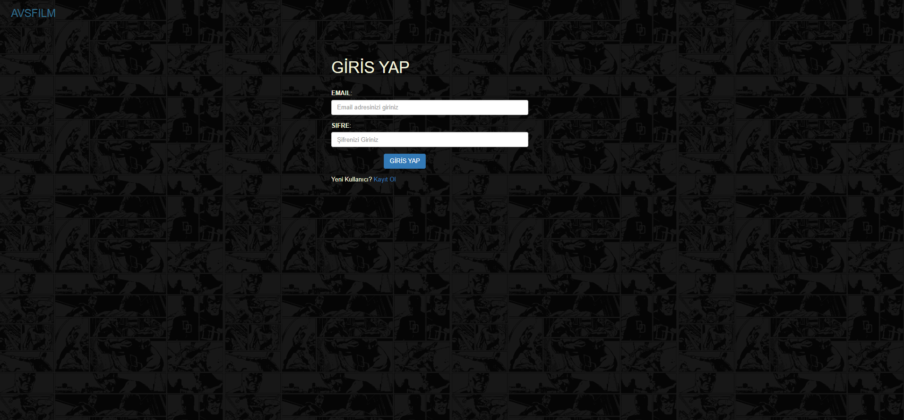
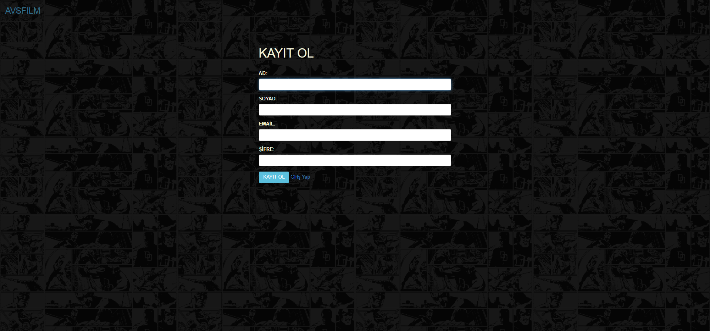
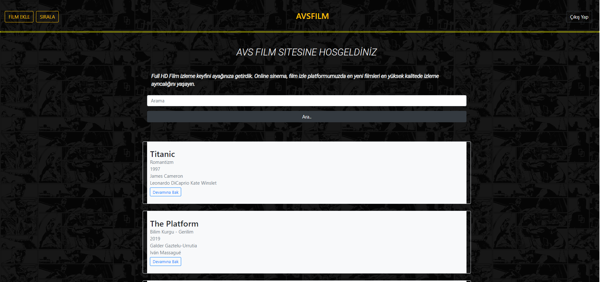
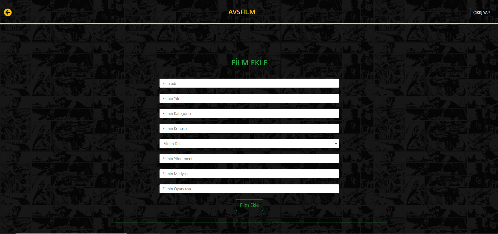
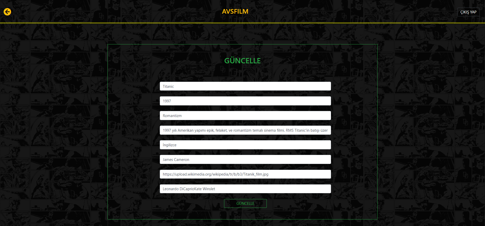
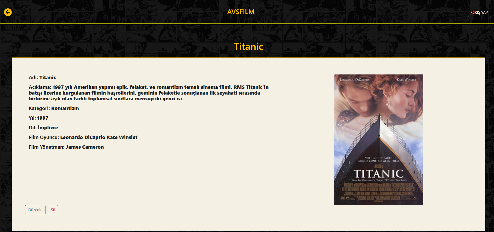

# AVSFILM
AVS film sitesine adınız, soyadınız ve mailiniz ile kaydolduktan sonra mail ve şifreniz ile giriş 
yapabilirsiniz. Giriş yaptıktan sonra film hakkında detaylı bilgi edinebilir,
film ekleyebilir, film üzerinde değişiklikler yapabilir ve filmi silebilirsiniz.

## MODULLER
* User Module

## KULLANILAN TEKNOLOJİLER
Otomatik Konfigürasyon için Spring Boot Web uygulaması geliştirme için Spring MVC Kullanıcı Arayüzü için kullanılan HTML JPA, Thymeleaf, Hibernate, Bootstrap kullanılan Veritabanı MySQL Kullanıldı

## AKSİYONLAR
- Giriş Yapma
- Kayıt Olma
- Film Ekleme
- Film Silme
- Film Güncelleme
- Film Ayrıntılarını Gösterme

## PROJE ÇALIŞTIRMA KOMUTU
* Projeyi indirin
* Netbeans/eclipse ide ile projeyi yükleyin
* MySQL'de adı filmkoleksiyonu olan bir veritabanı oluşturun
* Tomcat ve XAMPP ayarlarını yapın
* Sonunda projeyi çalıştırın

## RESİMLER

